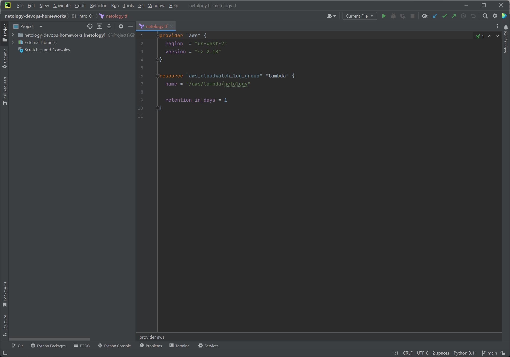
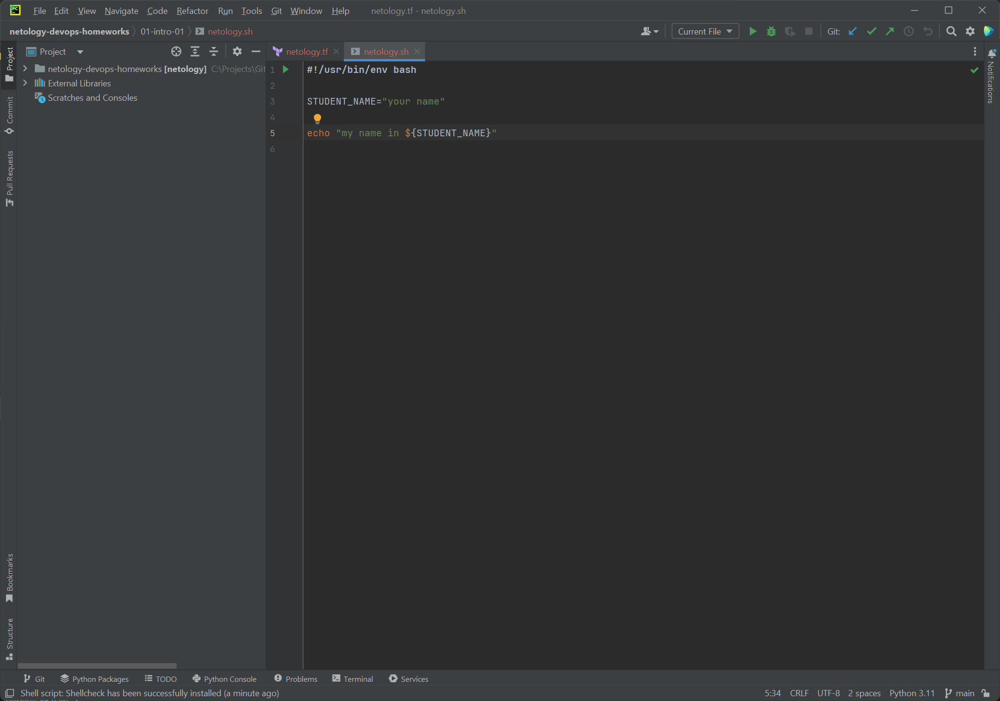
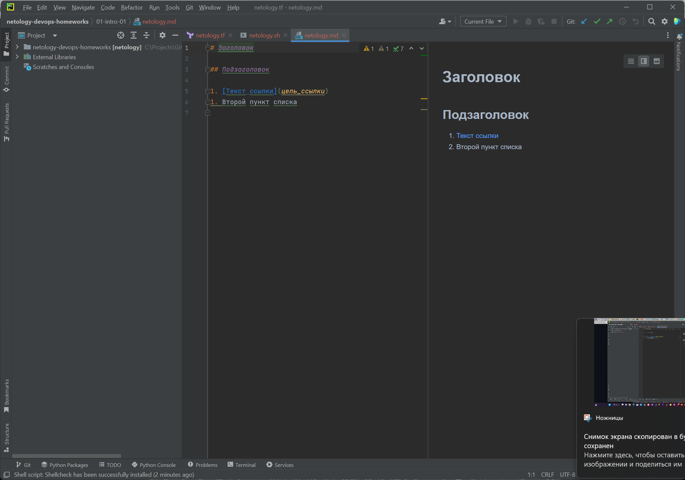
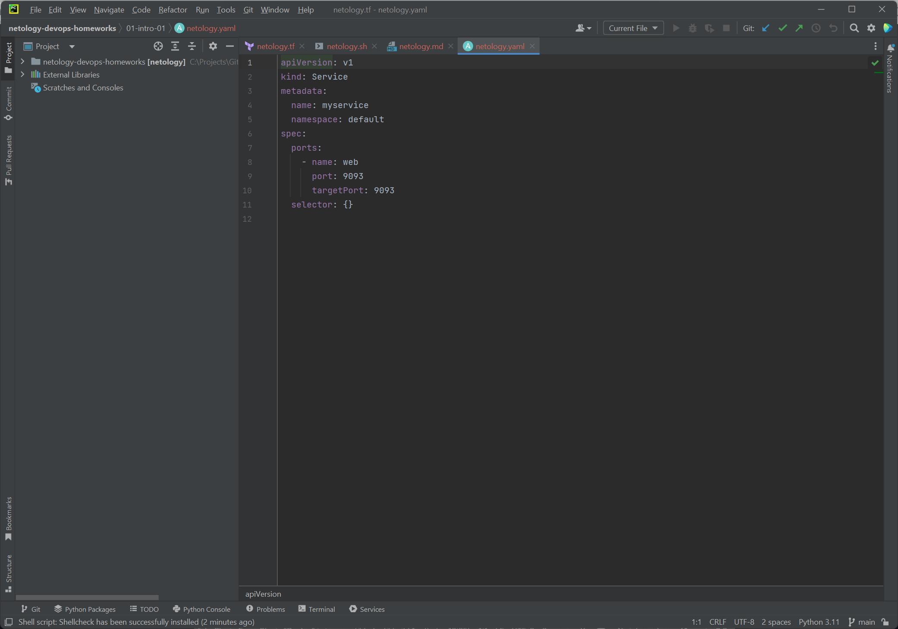
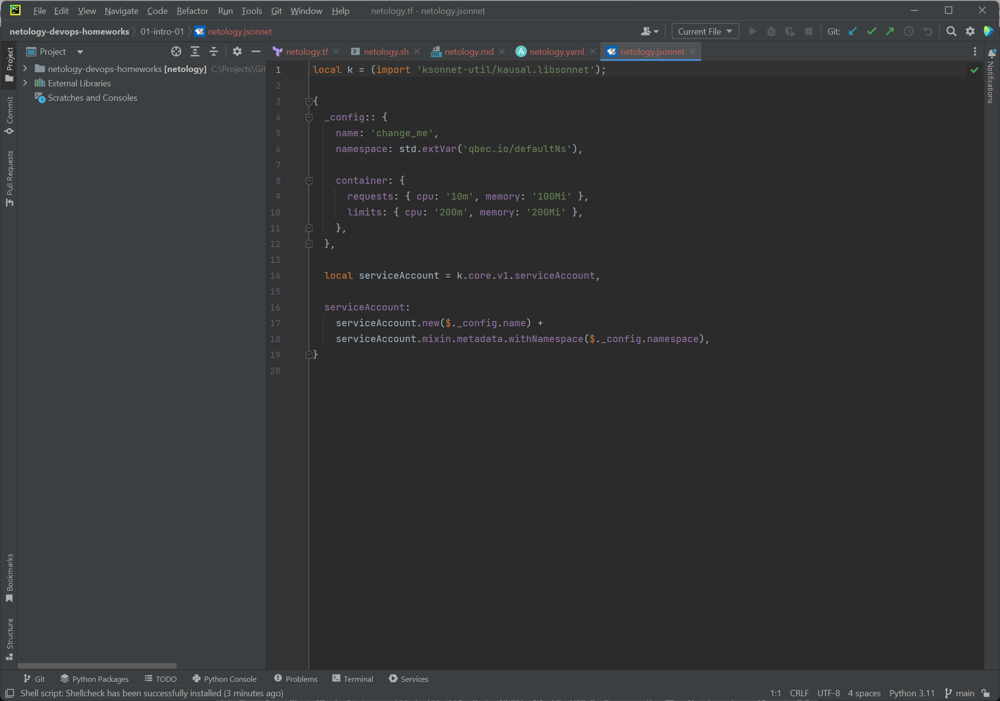

### Хакимов Тимур Ринатович

# Домашнее задание к занятию "Введение в DevOps"

## Задание 1. Подготовка рабочей среды
Скриншоты:
    - Terraform: 
    - Bash: 
    - Markdown: 
    - Yaml: 
    - Jsonnet: 

----

## Задание 2. Описание жизненного цикла задачи (разработки нового функционала)

Так как интернет-магазин, как продукт, уже существует, и предполагается постоянная реализаци новых фич для клиентов, логичным будет выбрать Scrum фреймворк.
Dev-ops настраивает VCS, внедряет CI/CD, Bug tracker, Knowledge систему, систему сбора логов и мониторинга, поднимает кластер контейнеров для четырех сред: production, demo, stage, dev

1. От клиентов приходят задачи. За новым клиентом закрепляется PM.
2. PM формирует ТЗ, назначает на задачу команду разработчиков, оценивает общее время выполнения задачи, выбирает количество и длительность спринтов в зависимости от капасити команды, каждый рабочий день проводится короткое собрание. 
3. Dev-ops выделяет ресурсы, доустанавливает необходимые компоненты, прописывает доступы, ключи etc.
4. Команда разработки выполняет работу в рамках спринта, используя dev кластер
5. По окончании спринта сделанная работа перемещается с кластера dev в кластер stage Dev-ops-ом
6. Команда QA тестирует работу в кластере stage. Если есть ошибки, возвращаемся к пункту 3
7. PM оценивает результат, и если есть замечание, возвращаемся к пункту 3 
8. Если задача разбита на несколько спринтов, переходим к пункту 3 в рамках нового спринта
9. Dev-ops помещеает работу в кластер demo. PM организует демонстрацию клиенту нового функционала в demo кластере
10. Если все ОК, работа выкладывается Dev-ops-ом в production, передается PM-ом клиенту. Если нет, создается новый спринт и возвращаемся к пункту 3.
11. Dev-ops освобождает ресурсы, если необходимо
12. PM мониторит фидбеки от клиента и при необходимости переходим к пункту 2 
13. Цикл повторяется

