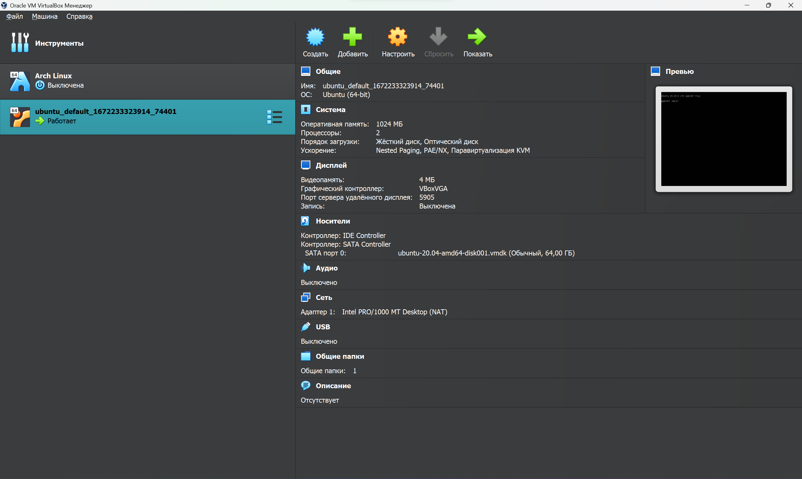

## Домашнее задание к занятию "3.1. Работа в терминале. Лекция 1"

* Ознакомьтесь с графическим интерфейсом VirtualBox, посмотрите как выглядит виртуальная машина, которую создал для вас Vagrant, какие аппаратные ресурсы ей выделены. Какие ресурсы выделены по-умолчанию?  

```
ОЗУ: 1024Mb  
Процессоров: 2
```

* Ознакомьтесь с возможностями конфигурации VirtualBox через Vagrantfile: [документация](https://www.vagrantup.com/docs/providers/virtualbox/configuration.html). Как добавить оперативной памяти или ресурсов процессора виртуальной машине?  
```
Vagrant.configure("2") do |config|
 	config.vm.box = "bento/ubuntu-20.04"
    v.memory = 8000
    v.cpus = 4
end
```

* Ознакомьтесь с разделами `man bash`, почитайте о настройках самого bash:
    * какой переменной можно задать длину журнала `history`, и на какой строчке manual это описывается?  
  ``HISTSIZE (размер в памяти) - строка 689 и HISTFILESIZE (размер на диске) - строка 678``
    * что делает директива `ignoreboth` в bash?  
  Это одно из значений переменной ``HISTCONTROL``:  
    ``ignorespace`` — не сохранять строки начинающиеся с символа <пробел>  
  ``ignoredups`` — не сохранять строки, совпадающие с последней выполненной командой  
  ``ignoreboth`` — использовать обе опции ‘ignorespace’ и ‘ignoredups’   
  

* В каких сценариях использования применимы скобки `{}` и на какой строчке `man bash` это описано?
Фигурные скобки используются для группировки команд, когда НЕ нужно создавать новый шелл для каждой команды ``{ list; }``. Описано на строке 216  


* С учётом ответа на предыдущий вопрос, как создать однократным вызовом `touch` 100000 файлов? Получится ли аналогичным образом создать 300000? Если нет, то почему?
1. В man bash поищите по `/\[\[`. Что делает конструкция `[[ -d /tmp ]]`
1. Сделайте так, чтобы в выводе команды `type -a bash` первым стояла запись с нестандартным путем, например bash is ... 
Используйте знания о просмотре существующих и создании новых переменных окружения, обратите внимание на переменную окружения PATH 

	```bash
	bash is /tmp/new_path_directory/bash
	bash is /usr/local/bin/bash
	bash is /bin/bash
	```

	(прочие строки могут отличаться содержимым и порядком)
    В качестве ответа приведите команды, которые позволили вам добиться указанного вывода или соответствующие скриншоты.

1. Чем отличается планирование команд с помощью `batch` и `at`?

