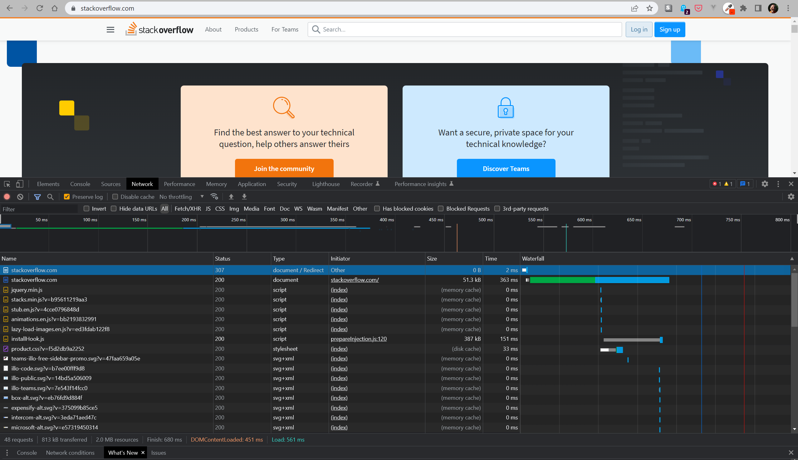

# Домашнее задание к занятию "3.6. Компьютерные сети. Лекция 1"

## Задание

1. Работа c HTTP через телнет.
- Подключитесь утилитой телнет к сайту stackoverflow.com
`telnet stackoverflow.com 80`
- Отправьте HTTP запрос
```bash
GET /questions HTTP/1.0
HOST: stackoverflow.com
[press enter]
[press enter]
```
*В ответе укажите полученный HTTP код, что он означает?*
### Ответ
```commandline
timur@LAPTOP-D947D6IL:~/projects/$ telnet stackoverflow.com 80
Trying 151.101.1.69...
Connected to stackoverflow.com.
Escape character is '^]'.
GET /questions HTTP/1.0
HOST: stackoverflow.com

HTTP/1.1 403 Forbidden
Connection: close
Content-Length: 1921
Server: Varnish
Retry-After: 0
Content-Type: text/html
Accept-Ranges: bytes
Date: Fri, 31 Mar 2023 17:21:01 GMT
Via: 1.1 varnish
X-Served-By: cache-hkg17920-HKG
X-Cache: MISS
X-Cache-Hits: 0
X-Timer: S1680283262.927220,VS0,VE1
X-DNS-Prefetch-Control: off
```
 403 - Forbidden, доступ к запрошенному ресурсу запрещен

2. Повторите задание 1 в браузере, используя консоль разработчика F12.
- откройте вкладку `Network`
- отправьте запрос http://stackoverflow.com
- найдите первый ответ HTTP сервера, откройте вкладку `Headers`
- укажите в ответе полученный HTTP код
- проверьте время загрузки страницы, какой запрос обрабатывался дольше всего?
- приложите скриншот консоли браузера в ответ.
### Ответ
Статус ответа - 307 - Internal Redirect. Дольше всего загружалась сама страница https://stackoverflow.com (363ms)



3. Какой IP адрес у вас в интернете?
### Ответ
```commandline
timur@LAPTOP-D947D6IL:~/projects$ curl ifconfig.me
31.148.164.118
```

4. Какому провайдеру принадлежит ваш IP адрес? Какой автономной системе AS? Воспользуйтесь утилитой `whois`
### Ответ
```commandline
timur@LAPTOP-D947D6IL:~/projects$ whois 31.148.164.118
% This is the RIPE Database query service.
% The objects are in RPSL format.
%
% The RIPE Database is subject to Terms and Conditions.
% See http://www.ripe.net/db/support/db-terms-conditions.pdf

% Note: this output has been filtered.
%       To receive output for a database update, use the "-B" flag.

% Information related to '31.148.160.0 - 31.148.167.255'

% Abuse contact for '31.148.160.0 - 31.148.167.255' is 'abuse@istv.uz'

inetnum:        31.148.160.0 - 31.148.167.255
netname:        ISTV-NET
country:        UZ
org:            ORG-ITL24-RIPE
admin-c:        ITLN2-RIPE
tech-c:         ITLN2-RIPE
status:         ASSIGNED PA
mnt-by:         RIPE-DB-MNT
mnt-by:         RIPE-DB-MNT
mnt-routes:     MNT-ISTV
mnt-domains:    RIPE-DB-MNT
created:        2018-05-01T10:43:34Z
last-modified:  2023-01-06T14:35:02Z
source:         RIPE

organisation:   ORG-ITL24-RIPE
org-name:       Inform-Service TV Ltd.
country:        UZ
org-type:       OTHER
phone:          +9998974244415
address:        120 Usta Shirin st., Tashkent, Uzbekistan
admin-c:        ITLN2-RIPE
tech-c:         ITLN2-RIPE
abuse-c:        ITLN2-RIPE
mnt-ref:        RIPE-DB-MNT
mnt-by:         RIPE-DB-MNT
created:        2011-06-29T12:14:21Z
last-modified:  2022-12-01T16:31:57Z
source:         RIPE # Filtered

role:           Inform-Service TV Ltd. NOC
phone:          +9998974244415
address:        120 Usta Shirin st., Tashkent, Uzbekistan
admin-c:        MS40035-RIPE
tech-c:         MS40035-RIPE
nic-hdl:        ITLN2-RIPE
abuse-mailbox:  abuse@istv.uz
mnt-by:         RIPE-DB-MNT
created:        2014-10-06T11:55:56Z
last-modified:  2016-11-25T14:17:35Z
source:         RIPE # Filtered

% Information related to '31.148.160.0/21AS57016'

route:          31.148.160.0/21
origin:         AS57016
mnt-by:         MNT-ISTV
mnt-by:         RIPE-DB-MNT
created:        2018-05-01T10:43:34Z
last-modified:  2018-05-01T10:43:34Z
source:         RIPE

% This query was served by the RIPE Database Query Service version 1.106 (DEXTER)
```
Провайдер: Inform-Service TV Ltd.
Номер автономной системы: AS57016
5. Через какие сети проходит пакет, отправленный с вашего компьютера на адрес 8.8.8.8? Через какие AS? Воспользуйтесь утилитой `traceroute`
### Ответ
```commandline
timur@LAPTOP-D947D6IL:~/projects$ traceroute -An 8.8.8.8
traceroute to 8.8.8.8 (8.8.8.8), 30 hops max, 60 byte packets
 1  172.19.96.1 [*]  0.284 ms  0.170 ms  0.148 ms
 2  192.168.0.1 [*]  1.137 ms  1.238 ms  1.177 ms
 3  31.135.208.8 [AS57016]  1.953 ms  1.921 ms  1.850 ms
 4  * * *
 5  * * *
 6  * 31.135.208.17 [AS57016]  2.181 ms  2.166 ms
 7  195.69.189.228 [AS28910]  2.982 ms  2.392 ms  3.084 ms
 8  195.69.189.39 [AS28910]  2.363 ms  2.358 ms  2.352 ms
 9  195.69.189.51 [AS28910]  2.345 ms  2.699 ms  2.686 ms
10  188.170.164.120 [AS31133]  35.653 ms  36.280 ms  35.638 ms
11  * * *
12  * * *
13  83.169.204.113 [AS31133]  56.886 ms 83.169.204.117 [AS31133]  55.432 ms 83.169.204.119 [AS31133]  138.031 ms
14  178.176.152.61 [AS31133]  76.401 ms  76.390 ms 72.14.222.181 [AS15169]  53.013 ms
15  108.170.250.66 [AS15169]  63.227 ms 108.170.250.83 [AS15169]  63.198 ms 108.170.250.99 [AS15169]  51.879 ms
16  142.251.237.156 [AS15169]  74.442 ms 172.253.66.116 [AS15169]  72.635 ms 142.251.237.156 [AS15169]  74.204 ms
17  142.250.235.68 [AS15169]  76.737 ms 142.251.238.70 [AS15169]  72.427 ms 108.170.232.251 [AS15169]  71.161 ms
18  * * *
19  * * *
20  * * *
21  * * *
22  * * *
23  * * *
24  * * *
25  * * *
26  * * *
27  * * *
28  * * *
29  * * *
30  * * *
```
6. Повторите задание 5 в утилите `mtr`. На каком участке наибольшая задержка - delay?
### Ответ
```commandline
timur@LAPTOP-D947D6IL:~/projects$ mtr -znt 8.8.8.8
LAPTOP-D947D6IL (172.19.97.248) -> 8.8.8.8                                                                                                                2023-03-31T20:43:57+0500
                                  Packets               Pings
 Host                           Loss%   Snt   Last   Avg  Best  Wrst StDev
 1. AS???    172.19.96.1         0.0%   237    0.4   0.3   0.2   0.7   0.1
 2. AS???    192.168.0.1         0.0%   237    1.1   2.8   0.9 326.7  21.2
 3. AS57016  31.135.208.8        0.0%   237    2.0   4.6   1.4 287.7  26.1
 4. (waiting for reply)
 5. (waiting for reply)
 6. AS57016  31.135.208.17       0.0%   237    2.1   4.0   1.6 178.8  15.8
 7. AS28910  195.69.189.228      0.0%   237    3.1   4.1   1.9 140.2  12.6
 8. AS28910  195.69.189.39       0.0%   236    2.7   5.5   2.2 427.0  29.0
 9. AS28910  195.69.189.51       0.0%   236    2.8   6.2   2.2 421.2  31.5
10. AS31133  188.170.164.122     0.0%   236   38.6  41.8  37.5 382.7  26.0
11. (waiting for reply)
12. (waiting for reply)
13. AS31133  83.169.204.113      0.0%   236   56.2  60.1  54.2 412.1  31.8
14. AS31133  178.176.152.61      0.0%   236   60.8  66.1  60.1 362.4  29.1
15. AS15169  108.170.250.146     0.0%   236   51.7  58.6  50.6 421.9  31.1
16. AS15169  209.85.249.158      0.0%   236   77.0  83.3  75.9 315.9  30.3
17. AS15169  108.170.235.204     0.0%   236   72.9  77.0  71.4 392.6  28.9
18. AS15169  216.239.49.107      0.0%   236   78.9  81.9  77.5 347.4  23.4
19. (waiting for reply)
20. (waiting for reply)
21. (waiting for reply)
22. (waiting for reply)
23. (waiting for reply)
24. (waiting for reply)
25. (waiting for reply)
26. (waiting for reply)
27. (waiting for reply)
28. AS15169  8.8.8.8             0.0%   236   72.1  75.2  71.4 536.2  31.9
```
На участке 15-16 средняя заержка максимальная = 83.3 ms
7. Какие DNS сервера отвечают за доменное имя dns.google? Какие A записи? Воспользуйтесь утилитой `dig`  
### Ответ
```commandline
timur@LAPTOP-D947D6IL:~/projects$ dig NS +short dns.google
ns2.zdns.google.
ns1.zdns.google.
ns4.zdns.google.
ns3.zdns.google.

timur@LAPTOP-D947D6IL:~/projects$ dig A +short dns.google
8.8.4.4
8.8.8.8
```
8. Проверьте PTR записи для IP адресов из задания 7. Какое доменное имя привязано к IP? Воспользуйтесь утилитой `dig`
### Ответ
```commandline
timur@LAPTOP-D947D6IL:~/projects$ dig PTR +short @8.8.4.4 @8.8.8.8 | sort
a.root-servers.net.
b.root-servers.net.
c.root-servers.net.
d.root-servers.net.
e.root-servers.net.
f.root-servers.net.
g.root-servers.net.
h.root-servers.net.
i.root-servers.net.
j.root-servers.net.
k.root-servers.net.
l.root-servers.net.
m.root-servers.net.
```

