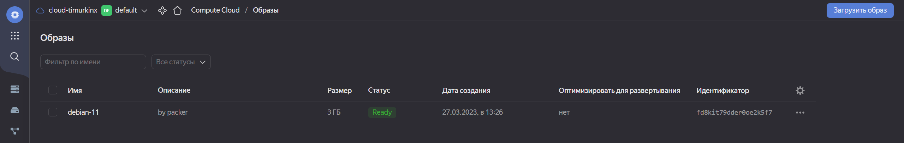
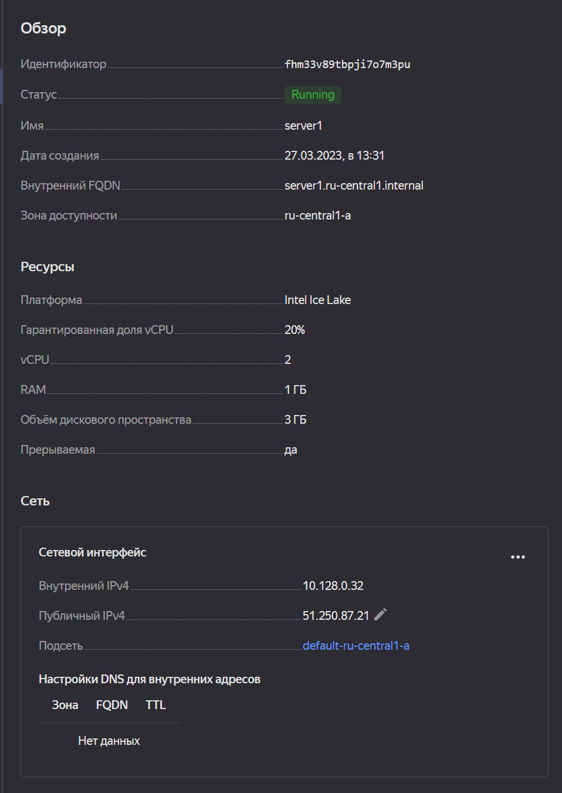
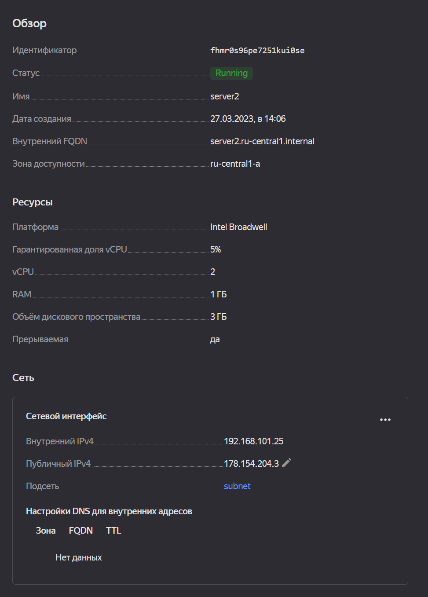
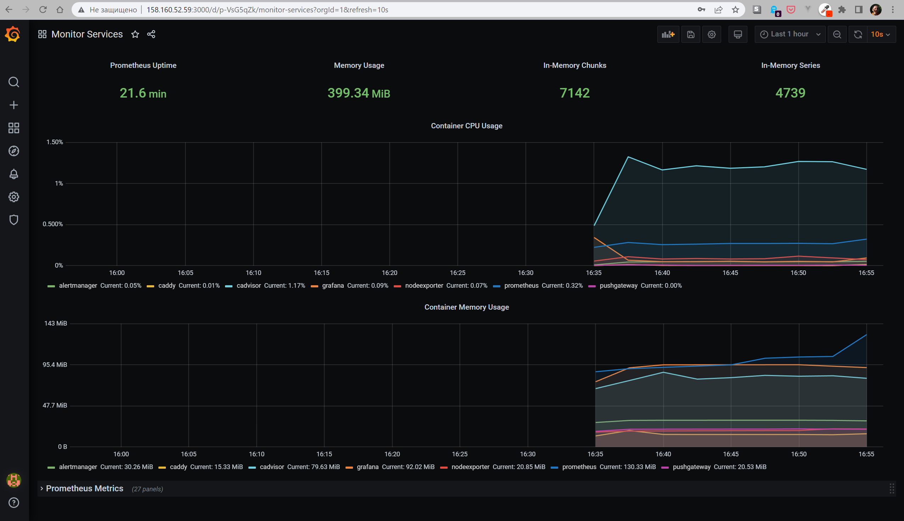

# Домашнее задание к занятию 4. «Оркестрация группой Docker-контейнеров на примере Docker Compose»

## Задача 1

Создайте собственный образ любой операционной системы (например ubuntu-20.04) с помощью Packer ([инструкция](https://cloud.yandex.ru/docs/tutorials/infrastructure-management/packer-quickstart)).

## Ответ


## Задача 2

**2.1.** Создайте вашу первую виртуальную машину в YandexCloud с помощью web-интерфейса YandexCloud.        

## Ответ


**2.2.*** **(Необязательное задание)**      
Создайте вашу первую виртуальную машину в YandexCloud с помощью Terraform (вместо использования веб-интерфейса YandexCloud).
Используйте Terraform-код в директории ([src/terraform](https://github.com/netology-group/virt-homeworks/tree/virt-11/05-virt-04-docker-compose/src/terraform)).

Чтобы получить зачёт, вам нужно предоставить вывод команды terraform apply и страницы свойств, созданной ВМ из личного кабинета YandexCloud.

## Ответ *

```commandline
timur@LAPTOP-D947D6IL:~/projects/devops-netology/05-virt-04-docker-compose/src/terraform$
terraform apply
yandex_vpc_network.default: Refreshing state... [id=enpgnnjccn37u2hjsoik]
yandex_vpc_subnet.default: Refreshing state... [id=e9bdubk5fmmmfs87bmbi]

Terraform used the selected providers to generate the following execution plan. Resource actions are indicated with the following symbols:
  + create

Terraform will perform the following actions:

  # yandex_compute_instance.server2 will be created
  + resource "yandex_compute_instance" "server2" {
      + allow_stopping_for_update = true
      + created_at                = (known after apply)
      + folder_id                 = (known after apply)
      + fqdn                      = (known after apply)
      + gpu_cluster_id            = (known after apply)
      + hostname                  = "server2"
      + id                        = (known after apply)
      + metadata                  = {
          + "ssh-keys" = <<-EOT
                timur:ssh-ed25519 AAAAC3NzaC1lZDI1NTE5AAAAIKUn/gGWFr/1blOlmnF+dumLV/7SoU1t+5JbAPzfWZ16 timur@LAPTOP-D947D6IL
            EOT
        }
      + name                      = "server2"
      + network_acceleration_type = "standard"
      + platform_id               = "standard-v1"
      + service_account_id        = (known after apply)
      + status                    = (known after apply)
      + zone                      = "ru-central1-a"

      + boot_disk {
          + auto_delete = true
          + device_name = (known after apply)
          + disk_id     = (known after apply)
          + mode        = (known after apply)

          + initialize_params {
              + block_size  = (known after apply)
              + description = (known after apply)
              + image_id    = "fd8kit79dder0oe2k5f7"
              + name        = "server2"
              + size        = 3
              + snapshot_id = (known after apply)
              + type        = "network-hdd"
            }
        }

      + network_interface {
          + index              = (known after apply)
          + ip_address         = (known after apply)
          + ipv4               = true
          + ipv6               = (known after apply)
          + ipv6_address       = (known after apply)
          + mac_address        = (known after apply)
          + nat                = true
          + nat_ip_address     = (known after apply)
          + nat_ip_version     = (known after apply)
          + security_group_ids = (known after apply)
          + subnet_id          = "e9bdubk5fmmmfs87bmbi"
        }

      + resources {
          + core_fraction = 5
          + cores         = 2
          + memory        = 1
        }

      + scheduling_policy {
          + preemptible = true
        }
    }

Plan: 1 to add, 0 to change, 0 to destroy.

Changes to Outputs:
  + external_ip_address_server2_yandex_cloud = (known after apply)
  + internal_ip_address_server2_yandex_cloud = (known after apply)

Do you want to perform these actions?
  Terraform will perform the actions described above.
  Only 'yes' will be accepted to approve.

  Enter a value: yes

yandex_compute_instance.server2: Creating...
yandex_compute_instance.server2: Still creating... [10s elapsed]
yandex_compute_instance.server2: Still creating... [20s elapsed]
yandex_compute_instance.server2: Still creating... [30s elapsed]
yandex_compute_instance.server2: Still creating... [40s elapsed]
yandex_compute_instance.server2: Still creating... [50s elapsed]
yandex_compute_instance.server2: Creation complete after 55s [id=fhmr0s96pe7251kui0se]

Apply complete! Resources: 1 added, 0 changed, 0 destroyed.

Outputs:

external_ip_address_server2_yandex_cloud = "178.154.204.3"
internal_ip_address_server2_yandex_cloud = "192.168.101.25"
timur@LAPTOP-D947D6IL:~/projects/devops-netology/05-virt-04-docker-compose/src/terraform$
```


## Задача 3

С помощью Ansible и Docker Compose разверните на виртуальной машине из предыдущего задания систему мониторинга на основе Prometheus/Grafana.
Используйте Ansible-код в директории ([src/ansible](https://github.com/netology-group/virt-homeworks/tree/virt-11/05-virt-04-docker-compose/src/ansible)).

Чтобы получить зачёт, вам нужно предоставить вывод команды "docker ps" , все контейнеры, описанные в [docker-compose](https://github.com/netology-group/virt-homeworks/blob/virt-11/05-virt-04-docker-compose/src/ansible/stack/docker-compose.yaml),  должны быть в статусе "Up".

## Ответ
```commandline
timur@server1:~$ sudo docker ps
CONTAINER ID   IMAGE                              COMMAND                  CREATED              STATUS                        PORTS
                              NAMES
b515913a32a4   stefanprodan/caddy                 "/sbin/tini -- caddy…"   About a minute ago   Up About a minute             0.0.0.0:3000->3000/tcp, 0.0.0.0:9090-9091->9090-9091/tcp, 0.0.0.0:9093->9093/tcp   caddy
9d95b0b5ffd5   prom/node-exporter:v0.18.1         "/bin/node_exporter …"   About a minute ago   Up About a minute             9100/tcp
                              nodeexporter
c9c5cab73de5   grafana/grafana:7.4.2              "/run.sh"                About a minute ago   Up About a minute             3000/tcp
                              grafana
3646898dab37   prom/prometheus:v2.17.1            "/bin/prometheus --c…"   About a minute ago   Up About a minute             9090/tcp
                              prometheus
68aba0613faf   prom/pushgateway:v1.2.0            "/bin/pushgateway"       About a minute ago   Up About a minute             9091/tcp
                              pushgateway
5f115ab893c7   gcr.io/cadvisor/cadvisor:v0.47.0   "/usr/bin/cadvisor -…"   About a minute ago   Up About a minute (healthy)   8080/tcp
                              cadvisor
b2cc343dd02b   prom/alertmanager:v0.20.0          "/bin/alertmanager -…"   About a minute ago   Up About a minute             9093/tcp
                              alertmanager
```
## Задача 4

1. Откройте веб-браузер, зайдите на страницу http://<внешний_ip_адрес_вашей_ВМ>:3000.
2. Используйте для авторизации логин и пароль из [.env-file](https://github.com/netology-group/virt-homeworks/blob/virt-11/05-virt-04-docker-compose/src/ansible/stack/.env).
3. Изучите доступный интерфейс, найдите в интерфейсе автоматически созданные docker-compose-панели с графиками([dashboards](https://grafana.com/docs/grafana/latest/dashboards/use-dashboards/)).
4. Подождите 5-10 минут, чтобы система мониторинга успела накопить данные.

## Ответ

