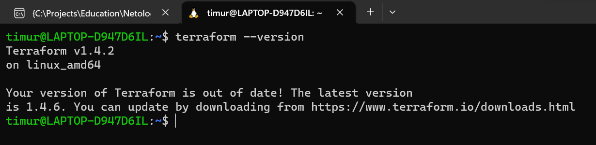

# Домашнее задание к занятию «Введение в Terraform»

### Чеклист готовности к домашнему заданию

1. Скачайте и установите актуальную версию **terraform** (не менее 1.3.7). Приложите скриншот вывода команды ```terraform --version```.  
#### Ответ


2. Скачайте на свой ПК данный git репозиторий. Исходный код для выполнения задания расположен в директории **01/src**.  
#### Ответ
``git clone https://github.com/netology-code/ter-homeworks/``  

3. Убедитесь, что в вашей ОС установлен docker.
#### Ответ
```commandline
timur@LAPTOP-D947D6IL:~$ docker version
Client: Docker Engine - Community
 Cloud integration: v1.0.31
 Version:           20.10.24
 API version:       1.41
 Go version:        go1.19.7
 Git commit:        297e128
 Built:             Tue Apr  4 18:21:00 2023
 OS/Arch:           linux/amd64
 Context:           default
 Experimental:      true

Server: Docker Desktop
 Engine:
  Version:          20.10.24
  API version:      1.41 (minimum version 1.12)
  Go version:       go1.19.7
  Git commit:       5d6db84
  Built:            Tue Apr  4 18:18:42 2023
  OS/Arch:          linux/amd64
  Experimental:     false
 containerd:
  Version:          1.6.18
  GitCommit:        2456e983eb9e37e47538f59ea18f2043c9a73640
 runc:
  Version:          1.1.4
  GitCommit:        v1.1.4-0-g5fd4c4d
 docker-init:
  Version:          0.19.0
  GitCommit:        de40ad0
```

------

### Задание 1

1. Перейдите в каталог [**src**](https://github.com/netology-code/ter-homeworks/tree/main/01/src). Скачайте все необходимые зависимости, использованные в проекте. 
#### Ответ
```commandline
timur@LAPTOP-D947D6IL:~/projects/devops-netology/07-tf-01/src$ terraform init

Initializing the backend...

Initializing provider plugins...
- Finding kreuzwerker/docker versions matching "~> 3.0.1"...
- Finding latest version of hashicorp/random...
- Installing kreuzwerker/docker v3.0.2...
- Installed kreuzwerker/docker v3.0.2 (self-signed, key ID BD080C4571C6104C)
- Installing hashicorp/random v3.5.1...
- Installed hashicorp/random v3.5.1 (signed by HashiCorp)

Partner and community providers are signed by their developers.
If you'd like to know more about provider signing, you can read about it here:
https://www.terraform.io/docs/cli/plugins/signing.html

Terraform has created a lock file .terraform.lock.hcl to record the provider
selections it made above. Include this file in your version control repository
so that Terraform can guarantee to make the same selections by default when
you run "terraform init" in the future.

Terraform has been successfully initialized!

You may now begin working with Terraform. Try running "terraform plan" to see
any changes that are required for your infrastructure. All Terraform commands
should now work.

If you ever set or change modules or backend configuration for Terraform,
rerun this command to reinitialize your working directory. If you forget, other
commands will detect it and remind you to do so if necessary.
```

------

2. Изучите файл **.gitignore**. В каком terraform файле допустимо сохранить личную, секретную информацию?

#### Ответ

В файле ``personal.auto.tfvars``. В комментарии прямо об этом сказано: ``# own secret vars store.``

------

3. Выполните код проекта. Найдите  в State-файле секретное содержимое созданного ресурса **random_password**. Пришлите его в качестве ответа.
#### Ответ
```commandline
timur@LAPTOP-D947D6IL:~/projects/devops-netology/07-tf-01/src$ terraform apply

Terraform used the selected providers to generate the following execution plan. Resource actions are indicated with the following symbols:
  + create

Terraform will perform the following actions:

  # random_password.random_string will be created
  + resource "random_password" "random_string" {
      + bcrypt_hash = (sensitive value)
      + id          = (known after apply)
      + length      = 16
      + lower       = true
      + min_lower   = 1
      + min_numeric = 1
      + min_special = 0
      + min_upper   = 1
      + number      = true
      + numeric     = true
      + result      = (sensitive value)
      + special     = false
      + upper       = true
    }

Plan: 1 to add, 0 to change, 0 to destroy.

Do you want to perform these actions?
  Terraform will perform the actions described above.
  Only 'yes' will be accepted to approve.

  Enter a value: yes

random_password.random_string: Creating...
random_password.random_string: Creation complete after 0s [id=none]

Apply complete! Resources: 1 added, 0 changed, 0 destroyed.
```
В файле ``terraform.tfstate`` секретное содержимое созданного ресурса **random_password** имеет значение ``Htfxz9IeNdaUIbgd``

------

4. Раскомментируйте блок кода, примерно расположенный на строчках 29-42 файла **main.tf**.
Выполните команду ```terraform validate```. Объясните в чем заключаются намеренно допущенные ошибки? Исправьте их.
#### Ответ
```commandline
timur@LAPTOP-D947D6IL:~/projects/devops-netology/07-tf-01/src$ terraform validate
╷
│ Error: Missing name for resource
│
│   on main.tf line 24, in resource "docker_image":
│   24: resource "docker_image" {
│
│ All resource blocks must have 2 labels (type, name).
╵
╷
│ Error: Invalid resource name
│
│   on main.tf line 29, in resource "docker_container" "1nginx":
│   29: resource "docker_container" "1nginx" {
│
│ A name must start with a letter or underscore and may contain only letters, digits, underscores, and dashes.
╵
```
Ошибки:  
1. Блок resource должен иметь два лейбла, первый - тип ресурса, второй - имя в текущем проекте, которое в сочетании с типом уникально в рамках текущего проекта. В данном случае во втором лейбле можно указать название docker образа.
2. Ограничение на значение второго лейбла. Строка (имя ресурса) должна начинаться с буквы или символа подчеркивания.  

Корректная версия:
```commandline
resource "docker_image" "nginx" {
  name         = "nginx:latest"
  keep_locally = true
}

resource "docker_container" "nginx" {
  image = docker_image.nginx.image_id
  name  = "example_${random_password.random_string.result}"

  ports {
    internal = 80
    external = 8000
  }
}
```
```commandline
timur@LAPTOP-D947D6IL:~/projects/devops-netology/07-tf-01/src$ terraform validate
Success! The configuration is valid.
```

------

5. Выполните код. В качестве ответа приложите вывод команды ```docker ps```  

#### Ответ

```commandline
timur@LAPTOP-D947D6IL:~/projects/devops-netology/07-tf-01/src$ docker ps
CONTAINER ID   IMAGE                             COMMAND                  CREATED         STATUS         PORTS                               NAMES
ebd996d92e44   448a08f1d2f9                      "/docker-entrypoint.…"   9 seconds ago   Up 7 seconds   0.0.0.0:8000->80/tcp                example_Htfxz9IeNdaUIbgd
```

------

6. Замените имя docker-контейнера в блоке кода на ```hello_world```, выполните команду ```terraform apply -auto-approve```.
Объясните своими словами, в чем может быть опасность применения ключа  ```-auto-approve``` ? 

#### Ответ

```commandline
timur@LAPTOP-D947D6IL:~/projects/devops-netology/07-tf-01/src$ docker ps
CONTAINER ID   IMAGE                             COMMAND                  CREATED          STATUS          PORTS                               NAMES
41c04926f4dd   448a08f1d2f9                      "/docker-entrypoint.…"   15 seconds ago   Up 14 seconds   0.0.0.0:8000->80/tcp                hello_world
```

Применение ключа ```-auto-approve``` не позволяет нам просмотреть plan **перед выполнением** и убедиться в том, что мы делаем то, что задумали, и отменить выполнение в противном случае.

------

7. Уничтожьте созданные ресурсы с помощью **terraform**. Убедитесь, что все ресурсы удалены. Приложите содержимое файла **terraform.tfstate**.  

#### Ответ

```commandline
timur@LAPTOP-D947D6IL:~/projects/devops-netology/07-tf-01/src$ terraform destroy
```
terraform.tfstate:
```json
{
  "version": 4,
  "terraform_version": "1.4.2",
  "serial": 11,
  "lineage": "146ccf4e-c634-349f-7e0f-296f8de63dcc",
  "outputs": {},
  "resources": [],
  "check_results": null
}

```

------

8. Объясните, почему при этом не был удален docker образ **nginx:latest** ?(Ответ найдите в коде проекта или документации)

#### Ответ

Docker образ **nginx:latest** не был удален, потому что был установлен параметр [**keep_locally = true**](https://registry.terraform.io/providers/kreuzwerker/docker/latest/docs/resources/image#keep_locally)

------
