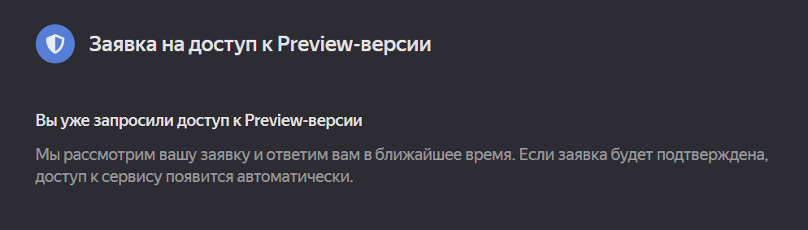
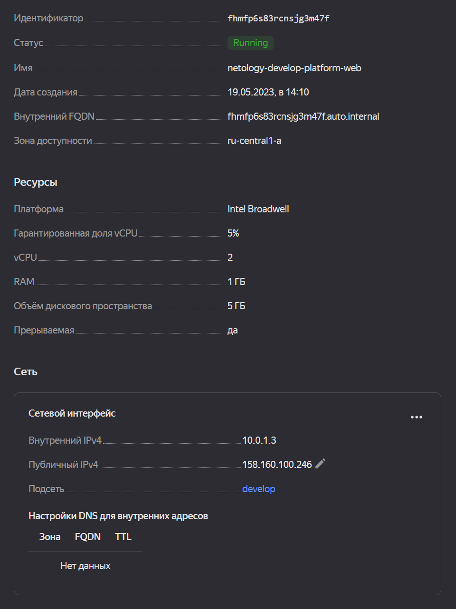

# Домашнее задание к занятию «Основы Terraform. Yandex Cloud»

### Задание 0

1. Ознакомьтесь с [документацией к security-groups в Yandex Cloud](https://cloud.yandex.ru/docs/vpc/concepts/security-groups?from=int-console-help-center-or-nav).  
2. Запросите preview доступ к данному функционалу в ЛК Yandex Cloud. Обычно его выдают в течении 24-х часов.
https://console.cloud.yandex.ru/folders/<ваш cloud_id>/vpc/security-groups.   
Этот функционал понадобится к следующей лекции.  


### Ответ

1. Ознакомился.  
2. Preview доступ:  



### Задание 1

1. Изучите проект. В файле variables.tf объявлены переменные для yandex provider.
2. Переименуйте файл personal.auto.tfvars_example в personal.auto.tfvars. Заполните переменные (идентификаторы облака, токен доступа). Благодаря .gitignore этот файл не попадет в публичный репозиторий. **Вы можете выбрать иной способ безопасно передать секретные данные в terraform.**
3. Сгенерируйте или используйте свой текущий ssh ключ. Запишите его открытую часть в переменную **vms_ssh_root_key**.
4. Инициализируйте проект, выполните код. Исправьте возникшую ошибку. Ответьте в чем заключается ее суть?
5. Ответьте, как в процессе обучения могут пригодиться параметры```preemptible = true``` и ```core_fraction=5``` в параметрах ВМ? Ответ в документации Yandex cloud.

В качестве решения приложите:
- скриншот ЛК Yandex Cloud с созданной ВМ,
- скриншот успешного подключения к консоли ВМ через ssh,
- ответы на вопросы.

### Ответ
Ошибка заключалась в том, что для ``platform_id = "standard-v1"`` и ``core_fraction = 5`` нельзя выделить instance с одним ядром ``cores = 1``, можно с двумя или четырьмя ``cores = 2 || 4``.  
Параметры ```preemptible = true```(прерываемая машина) и ```core_fraction=5```(гарантированная доля CPU в процентах) могут пригодиться для экономии бюджета.  



```commandline
timur@LAPTOP-D947D6IL:~/projects/devops-netology/07-tf-02/src$ ssh ubuntu@158.160.100.246
Welcome to Ubuntu 20.04.6 LTS (GNU/Linux 5.4.0-148-generic x86_64)

 * Documentation:  https://help.ubuntu.com
 * Management:     https://landscape.canonical.com
 * Support:        https://ubuntu.com/advantage
New release '22.04.2 LTS' available.
Run 'do-release-upgrade' to upgrade to it.


The programs included with the Ubuntu system are free software;
the exact distribution terms for each program are described in the
individual files in /usr/share/doc/*/copyright.

Ubuntu comes with ABSOLUTELY NO WARRANTY, to the extent permitted by
applicable law.

To run a command as administrator (user "root"), use "sudo <command>".
See "man sudo_root" for details.

ubuntu@fhmfp6s83rcnsjg3m47f:~$
```

### Задание 2

1. Изучите файлы проекта.
2. Замените все "хардкод" **значения** для ресурсов **yandex_compute_image** и **yandex_compute_instance** на **отдельные** переменные. К названиям переменных ВМ добавьте в начало префикс **vm_web_** .  Пример: **vm_web_name**.
2. Объявите нужные переменные в файле variables.tf, обязательно указывайте тип переменной. Заполните их **default** прежними значениями из main.tf. 
3. Проверьте terraform plan (изменений быть не должно). 

### Ответ
```hcl
variable "vpc_image_family" {
  type        = string
  default     = "ubuntu-2004-lts"
  description = "Yandex compute instance image family name"
}
variable "vpc_web_name" {
  type        = string
  default     = "netology-develop-platform-web"
  description = "Yandex compute instance name"
}
variable "vpc_web_platform" {
  type        = string
  default     = "standard-v1"
  description = "Yandex compute instance platform"
}
variable "vpc_web_cores" {
  type        = number
  default     = 2
  description = "Yandex compute instance cores number"
}
variable "vpc_web_memory" {
  type        = number
  default     = 1
  description = "Yandex compute instance memory"
}
variable "vpc_web_core_fraction" {
  type        = number
  default     = 5
  description = "Yandex compute instance core fraction in procents"
}
variable "vpc_web_preemptible" {
  type        = bool
  default     = true
  description = "Yandex compute instance preemptible"
}
variable "vpc_web_nat" {
  type        = bool
  default     = true
  description = "Yandex compute instance nat"
}
variable "vpc_web_serial_port" {
  type        = number
  default     = 1
  description = "Yandex compute instance serial port"
}

variable "vpc_web_ssh_user" {
  type        = string
  default     = "ubuntu"
  description = "Yandex compute instance ssh user"
}

data "yandex_compute_image" "ubuntu" {
  family = var.vpc_image_family
}

resource "yandex_compute_instance" "platform" {
  name        = var.vpc_web_name
  platform_id = var.vpc_web_platform
  resources {
    cores         = var.vpc_web_cores
    memory        = var.var.vpc_web_memory
    core_fraction = var.vpc_web_core_fraction
  }
  boot_disk {
    initialize_params {
      image_id = data.yandex_compute_image.ubuntu.image_id
    }
  }
  scheduling_policy {
    preemptible = var.vpc_web_preemptible
  }
  network_interface {
    subnet_id = yandex_vpc_subnet.develop.id
    nat       = var.vpc_web_nat
  }

  metadata = {
    serial-port-enable = var.vpc_web_serial_port
    ssh-keys           = "${ var.vpc_web_ssh_user }:${ var.vms_ssh_root_key }"
  }
}

```
```commandline
timur@LAPTOP-D947D6IL:~/projects/devops-netology/07-tf-02/src$ terraform plan
data.yandex_compute_image.ubuntu: Reading...
yandex_vpc_network.develop: Refreshing state... [id=enp6kli73mtntoi9kgf4]
data.yandex_compute_image.ubuntu: Read complete after 0s [id=fd83gfh90hpp3sojs1r3]
yandex_vpc_subnet.develop: Refreshing state... [id=e9b1voop26f1cc98on4i]
yandex_compute_instance.platform: Refreshing state... [id=fhmfp6s83rcnsjg3m47f]

No changes. Your infrastructure matches the configuration.

Terraform has compared your real infrastructure against your configuration and found no differences, so no changes are needed.
```

### Задание 3

1. Создайте в корне проекта файл 'vms_platform.tf' . Перенесите в него все переменные первой ВМ.
2. Скопируйте блок ресурса и создайте с его помощью вторую ВМ(в файле main.tf): **"netology-develop-platform-db"** ,  cores  = 2, memory = 2, core_fraction = 20. Объявите ее переменные с префиксом **vm_db_** в том же файле('vms_platform.tf').
3. Примените изменения.

### Ответ

[vms_platform.tf](src/vms_platform.tf)  
[main.tf](src/main.tf)


### Задание 4

1. Объявите в файле outputs.tf отдельные output, для каждой из ВМ с ее внешним IP адресом.
2. Примените изменения.

В качестве решения приложите вывод значений ip-адресов команды ```terraform output```

### Ответ

```commandline
timur@LAPTOP-D947D6IL:~/projects/devops-netology/07-tf-02/src$ terraform output
vm_db_ip = "51.250.89.90"
vm_web_ip = "158.160.40.115"
```
Примечание: IP адрес здесь не совпадает с IP адресом vm_web из первого задания, т.к. ради экономии я останавливал машину, а при перезапуске внешний IP меняется. 
### Задание 5

1. В файле locals.tf опишите в **одном** local-блоке имя каждой ВМ, используйте интерполяцию ${..} с несколькими переменными по примеру из лекции.
2. Замените переменные с именами ВМ из файла variables.tf на созданные вами local переменные.
3. Примените изменения.

### Ответ

[locals.tf](src/locals.tf)


### Задание 6

1. Вместо использования 3-х переменных  ".._cores",".._memory",".._core_fraction" в блоке  resources {...}, объедените их в переменные типа **map** с именами "vm_web_resources" и "vm_db_resources".
2. Так же поступите с блоком **metadata {serial-port-enable, ssh-keys}**, эта переменная должна быть общая для всех ваших ВМ.
3. Найдите и удалите все более не используемые переменные проекта.
4. Проверьте terraform plan (изменений быть не должно).

### Ответ
[variables.tf](src/variables.tf)  
[locals.tf](src/locals.tf)  
[vms_platform.tf](src/vms_platform.tf)  
[main.tf](src/main.tf)

------

### Задание 7*

Изучите содержимое файла console.tf. Откройте terraform console, выполните следующие задания: 

1. Напишите, какой командой можно отобразить **второй** элемент списка test_list?
2. Найдите длину списка test_list с помощью функции length(<имя переменной>).
3. Напишите, какой командой можно отобразить значение ключа admin из map test_map ?
4. Напишите interpolation выражение, результатом которого будет: "John is admin for production server based on OS ubuntu-20-04 with X vcpu, Y ram and Z virtual disks", используйте данные из переменных test_list, test_map, servers и функцию length() для подстановки значений.

В качестве решения предоставьте необходимые команды и их вывод.

### Ответ

```commandline
timur@LAPTOP-D947D6IL:~/projects/devops-netology/07-tf-02/src$ terraform console
> local.test_list[1]
"staging"
> length(local.test_list)
3
> local.test_map["admin"]
"John"
> local.test_map.admin
"John"
> "${ local.test_map.admin } is ${ keys(local.test_map)[0] } for ${ local.test_list[2] } server based on OS ${ local.servers.production.image } with ${ local.servers.production.cpu } vcpu, ${ local.servers.production.ram } ram and ${ length(local.servers.production.disks) } virtual disks"
"John is admin for production server based on OS ubuntu-20-04 with 10 vcpu, 40 ram and 4 virtual disks"
```
