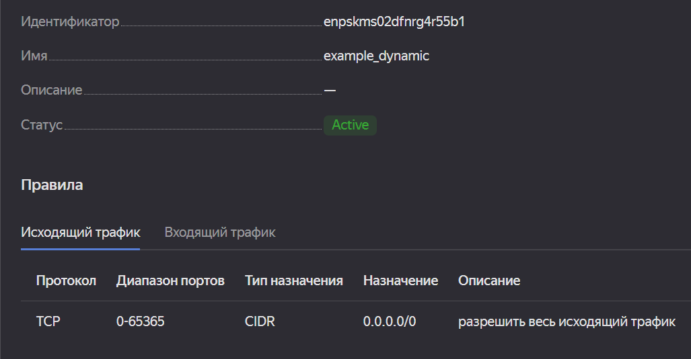
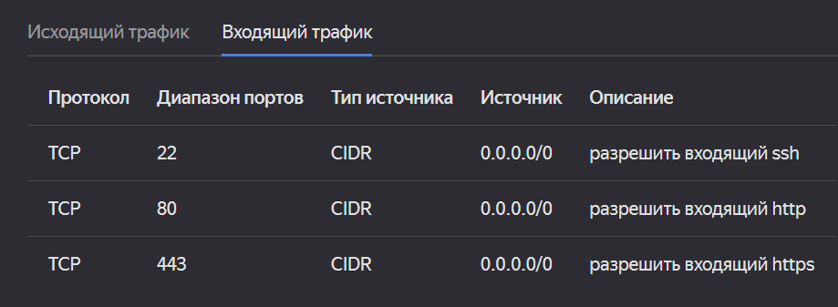

# Домашнее задание к занятию "Управляющие конструкции в коде Terraform"

### Инструменты/ дополнительные материалы, которые пригодятся для выполнения задания

1. [Консоль управления Yandex Cloud](https://console.cloud.yandex.ru/folders/<cloud_id>/vpc/security-groups).
2. [Группы безопасности](https://cloud.yandex.ru/docs/vpc/concepts/security-groups?from=int-console-help-center-or-nav).
3. [Datasource compute disk](https://terraform-eap.website.yandexcloud.net/docs/providers/yandex/d/datasource_compute_disk.html).


### Задание 1

1. Изучите проект.
2. Заполните файл personal.auto.tfvars
3. Инициализируйте проект, выполните код (он выполнится даже если доступа к preview нет).

Примечание: Если у вас не активирован preview доступ к функционалу "Группы безопасности" в Yandex Cloud - запросите доступ у поддержки облачного провайдера. Обычно его выдают в течении 24-х часов.

Приложите скриншот входящих правил "Группы безопасности" в ЛК Yandex Cloud  или скриншот отказа в предоставлении доступа к preview версии.

### Ответ





------

### Задание 2

1. Создайте файл count-vm.tf. Опишите в нем создание двух **одинаковых** виртуальных машин с минимальными параметрами, используя мета-аргумент **count loop**.
2. Создайте файл for_each-vm.tf. Опишите в нем создание 2 **разных** по cpu/ram/disk виртуальных машин, используя мета-аргумент **for_each loop**. Используйте переменную типа list(object({ vm_name=string, cpu=number, ram=number, disk=number  })). При желании внесите в переменную все возможные параметры.
3. ВМ из пункта 2.2 должны создаваться после создания ВМ из пункта 2.1.
4. Используйте функцию file в local переменной для считывания ключа ~/.ssh/id_rsa.pub и его последующего использования в блоке metadata, взятому из ДЗ №2.
5. Инициализируйте проект, выполните код.

### Ответ
[**count-vm.tf**](src/count-vm.tf)  
[**for_each-vm.tf**](src/for_each-vm.tf)  
[**vms_platform.tf**](src/vms_platform.tf)  
[**locals.tf**](src/locals.tf)  


------

### Задание 3

1. Создайте 3 одинаковых виртуальных диска, размером 1 Гб с помощью ресурса yandex_compute_disk и мета-аргумента count.
2. Создайте одну **любую** ВМ. Используйте блок **dynamic secondary_disk{..}** и мета-аргумент for_each для подключения созданных вами дополнительных дисков.
3. Назначьте ВМ созданную в 1-м задании группу безопасности.

[**main.tf**](src/main.tf)  


------

### Задание 4

1. Создайте inventory-файл для ansible.
Используйте функцию tepmplatefile и файл-шаблон для создания ansible inventory-файла из лекции.
Готовый код возьмите из демонстрации к лекции [**demonstration2**](https://github.com/netology-code/ter-homeworks/tree/main/demonstration2).
Передайте в него в качестве переменных имена и внешние ip-адреса ВМ из задания 2.1 и 2.2.
2. Выполните код. Приложите скриншот получившегося файла.

### Ответ

```commandline
[webservers]

netology-development-platform-web-0   ansible_host=158.160.58.184
netology-development-platform-web-1   ansible_host=84.252.129.177
netology-development-platform-db-main   ansible_host=51.250.84.102
netology-development-platform-db-replica   ansible_host=158.160.59.55
netology-development-platform-web-storage   ansible_host=158.160.55.42
```

------

## Дополнительные задания (со звездочкой*)

**Настоятельно рекомендуем выполнять все задания под звёздочкой.**   Их выполнение поможет глубже разобраться в материале.   
Задания под звёздочкой дополнительные (необязательные к выполнению) и никак не повлияют на получение вами зачета по этому домашнему заданию. 

### Задание 5*(необязательное)
1. Напишите output, который отобразит все 5 созданных ВМ в виде списка словарей:
``` 
[
 {
  "name" = 'имя ВМ1'
  "id"   = 'идентификатор ВМ1'
  "fqdn" = 'Внутренний FQDN ВМ1'
 },
 {
  "name" = 'имя ВМ2'
  "id"   = 'идентификатор ВМ2'
  "fqdn" = 'Внутренний FQDN ВМ2'
 },
 ....
]
```
Приложите скриншот вывода команды ```terrafrom output```

### Ответ
```commandline
output "hosts" {
  value = [for e in local.webservers : { fqdn = e.fqdn, id = e.id, name = e.name, }]
}
locals {
  ...
  webservers =  flatten([
    yandex_compute_instance.web_hosts[*],
    [for i, e in yandex_compute_instance.db_hosts : e],
    yandex_compute_instance.web_storage_host,
  ])
}
```

```commandline
timur@LAPTOP-D947D6IL:~/projects/devops-netology/07-tf-03/src$ terraform output hosts
[
  {
    "fqdn" = "fhm2lpsc1n19h4dtetia.auto.internal"
    "id" = "fhm2lpsc1n19h4dtetia"
    "name" = "netology-development-platform-web-0"
  },
  {
    "fqdn" = "fhmcft3v9ehima2soesr.auto.internal"
    "id" = "fhmcft3v9ehima2soesr"
    "name" = "netology-development-platform-web-1"
  },
  {
    "fqdn" = "fhmh8o6bdal3nngmegej.auto.internal"
    "id" = "fhmh8o6bdal3nngmegej"
    "name" = "netology-development-platform-db-main"
  },
  {
    "fqdn" = "fhmdfkql93t8p2ojdk2l.auto.internal"
    "id" = "fhmdfkql93t8p2ojdk2l"
    "name" = "netology-development-platform-db-replica"
  },
  {
    "fqdn" = "fhmjkourl623p1hmp41l.auto.internal"
    "id" = "fhmjkourl623p1hmp41l"
    "name" = "netology-development-platform-web-storage"
  },
]
```
------

### Задание 6*(необязательное)

1. Используя null_resource и local-exec примените ansible-playbook к ВМ из ansible inventory файла.
Готовый код возьмите из демонстрации к лекции [**demonstration2**](https://github.com/netology-code/ter-homeworks/tree/main/demonstration2).
3. Дополните файл шаблон hosts.tftpl. 
Формат готового файла:
```netology-develop-platform-web-0   ansible_host="<внешний IP-address или внутренний IP-address если у ВМ отсутвует внешний адрес>"```

Для проверки работы уберите у ВМ внешние адреса. Этот вариант используется при работе через bastion сервер.
Для зачета предоставьте код вместе с основной частью задания.


