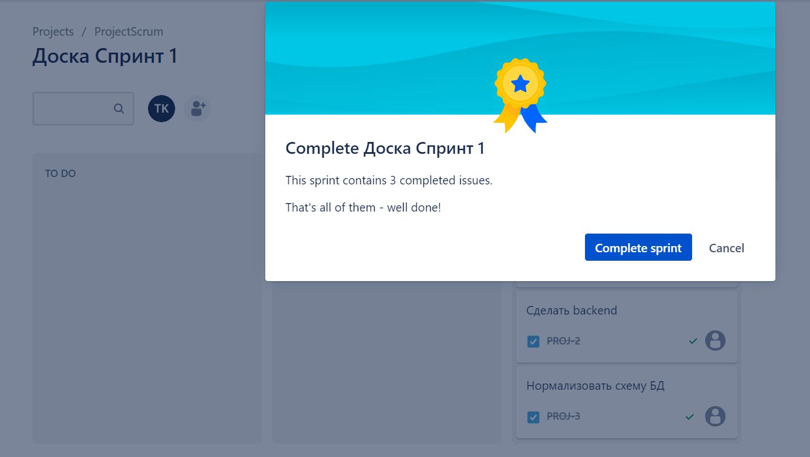

# Домашнее задание к занятию 7 «Жизненный цикл ПО»

## Подготовка к выполнению

1. Получить бесплатную версию [Jira](https://www.atlassian.com/ru/software/jira/free).
2. Настроить её для своей команды разработки.
3. Создать доски Kanban и Scrum.

## Основная часть

Необходимо создать собственные workflow для двух типов задач: bug и остальные типы задач. Задачи типа bug должны проходить жизненный цикл:

1. Open -> On reproduce.
2. On reproduce -> Open, Done reproduce.
3. Done reproduce -> On fix.
4. On fix -> On reproduce, Done fix.
5. Done fix -> On test.
6. On test -> On fix, Done.
7. Done -> Closed, Open.

Остальные задачи должны проходить по упрощённому workflow:

1. Open -> On develop.
2. On develop -> Open, Done develop.
3. Done develop -> On test.
4. On test -> On develop, Done.
5. Done -> Closed, Open.

**Что нужно сделать**

1. Создайте задачу с типом bug, попытайтесь провести его по всему workflow до Done. 
1. Создайте задачу с типом epic, к ней привяжите несколько задач с типом task, проведите их по всему workflow до Done. 
1. При проведении обеих задач по статусам используйте kanban. 
1. Верните задачи в статус Open.
1. Перейдите в Scrum, запланируйте новый спринт, состоящий из задач эпика и одного бага, стартуйте спринт, проведите задачи до состояния Closed. Закройте спринт.
2. Если всё отработалось в рамках ожидания — выгрузите схемы workflow для импорта в XML. Файлы с workflow и скриншоты workflow приложите к решению задания.

---

### Ответ
### Bug workflow

### Others' workflow

### Закрытие спринта

---

### NB

Я не понял где нужно было выгрузить схему workflow в XML. Если зайти в настройки проекта, то там нет раздела Workflows. Из "Manage workflows" выгрузить тоже нельзя. Единственное, где я нашел выгрузку, это Бизнес-процессы, которые доступны из Шестиренка -> Issues. Но там в списке нет Workflow, которые я создал. Еще проблема в том, что Workflow не переключается при смене типа задачи. Непонятно, как это вообще должно работать. Нужно было создать две доски или должен был быть один большой workflow для всех типов задач, просто с ограничением переходов в статусы?

---

