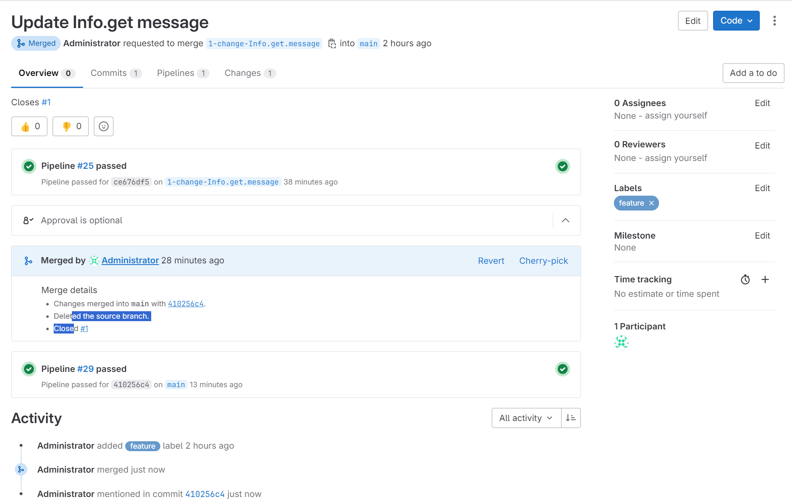

# Домашнее задание к занятию 12 «GitLab»
tELqyKMDOVsdJX3UDNzSvKwnXj8UwykR12iFEbc4W1c=

## Основная часть

### DevOps

В репозитории содержится код проекта на Python. Проект — RESTful API сервис. Ваша задача — автоматизировать сборку образа с выполнением python-скрипта:

1. Образ собирается на основе [centos:7](https://hub.docker.com/_/centos?tab=tags&page=1&ordering=last_updated).
2. Python версии не ниже 3.7.
3. Установлены зависимости: `flask` `flask-jsonpify` `flask-restful`.
4. Создана директория `/python_api`.
5. Скрипт из репозитория размещён в /python_api.
6. Точка вызова: запуск скрипта.
7. При комите в любую ветку должен собираться docker image с форматом имени hello:gitlab-$CI_COMMIT_SHORT_SHA . Образ должен быть выложен в Gitlab registry или yandex registry.   
8.* (задание необязательное к выполению) При комите в ветку master после сборки должен подняться pod в kubernetes. Примерный pipeline для push в kubernetes по [ссылке](https://github.com/awertoss/devops-netology/blob/main/09-ci-06-gitlab/gitlab-ci.yml).
Если вы еще не знакомы с k8s - автоматизируйте сборку и деплой приложения в docker на виртуальной машине.

### Product Owner

Вашему проекту нужна бизнесовая доработка: нужно поменять JSON ответа на вызов метода GET `/rest/api/get_info`, необходимо создать Issue в котором указать:

1. Какой метод необходимо исправить.
2. Текст с `{ "message": "Already started" }` на `{ "message": "Running"}`.
3. Issue поставить label: feature.

### Developer

Пришёл новый Issue на доработку, вам нужно:

1. Создать отдельную ветку, связанную с этим Issue.
2. Внести изменения по тексту из задания.
3. Подготовить Merge Request, влить необходимые изменения в `master`, проверить, что сборка прошла успешно.


### Tester

Разработчики выполнили новый Issue, необходимо проверить валидность изменений:

1. Поднять докер-контейнер с образом `python-api:latest` и проверить возврат метода на корректность.
2. Закрыть Issue с комментарием об успешности прохождения, указав желаемый результат и фактически достигнутый.

## Итог

В качестве ответа пришлите подробные скриншоты по каждому пункту задания:

- файл gitlab-ci.yml;
- Dockerfile; 
- лог успешного выполнения пайплайна;
- решённый Issue.

### Ответ
**gitlab-ci.yml**  
```yaml
stages:
  - deploy

image: docker:latest

services:
  - docker:dind

deployer:
   stage: deploy
   script:
       - docker login $CI_REGISTRY -u $CI_REGISTRY_USER -p $CI_REGISTRY_PASSWORD
       - docker pull $CI_REGISTRY/python-api:latest || true
       - docker build --cache-from $CI_REGISTRY/python-api:latest --tag $CI_REGISTRY/python-api:gitlab-$CI_COMMIT_SHORT_SHA --tag $CI_REGISTRY/python-api:latest .
       - docker push $CI_REGISTRY/python-api:gitlab-$_COMMIT_SHORT_SHA
       - docker push $CI_REGISTRY/python-api:latest
```

**Dockerfile**
```yaml
FROM centos:7

RUN yum install -y epel-release && \
    yum install -y gcc make openssl-devel bzip2-devel libffi-devel zlib-devel xz-devel wget && \
    wget https://www.python.org/ftp/python/3.9.1/Python-3.9.1.tgz && \
    tar xzf Python-3.9.1.tgz

RUN cd Python-3.9.1 && \
    ./configure --enable-optimizations && \
    make install

RUN /usr/local/bin/python3.9 -m pip install --upgrade pip

RUN  /usr/local/bin/python3.9 -m pip install flask flask-jsonpify flask-restful

RUN rm -f /Python-3.9.1.tgz && rm -rf /Python-3.9.1

RUN yum remove -y gcc make openssl-devel bzip2-devel libffi-devel zlib-devel xz-devel wget

RUN mkdir /python_api

COPY python-api.py /python_api

WORKDIR /python_api

CMD ["/usr/local/bin/python3.9", "python-api.py"]
```

[**Pipeline full log**](pipeline.log)  

**Решенный Issue**  
  

**Проверка работы**
```
timur@LAPTOP-D947D6IL:~$ yc iam create-token
t1.9euelZqKlomLi46bzpiYzceYzJzJje3rnpWazouTnJeLycybipOQkpmanczl9PdvOWpT-e8REzS83fT3L2hnU_nvERM0vM3n9euelZqTkIrNyY6Vj5aOkI6JlMqJy-_8xeuelZqTkIrNyY6Vj5aOkI6JlMqJyw.JQmJGDmXM-4IGACqLYR0OCC8b7RtA9TY18JsoAsnxJJMXtlBZ2qJV8aJ2kOu8PsorhnYSV3N0K6EfslzkD0FAQ

timur@LAPTOP-D947D6IL:~$ docker login cr.yandex/crpmocvsvnp36isb7726 -u iam -p t1.9euelZqKlomLi46bzpiYzceYzJzJje3rnpWazouTnJeLycybipOQkpmanczl9PdvOWpT-e8REzS83fT3L2hnU_nvERM0vM3n9euelZqTkIrNyY6Vj5aOkI6JlMqJy-_8xeuelZqTkIrNyY6Vj5aOkI6JlMqJyw.JQmJGDmXM-4IGACqLYR0OCC8b7RtA9TY18JsoAsnxJJMXtlBZ2qJV8aJ2kOu8PsorhnYSV3N0K6EfslzkD0FAQ
WARNING! Using --password via the CLI is insecure. Use --password-stdin.
Login Succeeded

timur@LAPTOP-D947D6IL:~$ docker pull cr.yandex/crpmocvsvnp36isb7726/python-api:latest
latest: Pulling from crpmocvsvnp36isb7726/python-api
2d473b07cdd5: Already exists
c4e1592cb819: Pull complete
7d1a75ef2673: Pull complete
2f26a580afd8: Pull complete
02e016f66659: Pull complete
488d95aba06d: Pull complete
1ec9570adb86: Pull complete
23e3a979eca3: Pull complete
6e4c3f18f146: Pull complete
4f4fb700ef54: Pull complete
Digest: sha256:f0a8884b37ff699ede546f68fe3e985fe939ced7d76f78d4d0d47a17f34d9013
Status: Downloaded newer image for cr.yandex/crpmocvsvnp36isb7726/python-api:latest
cr.yandex/crpmocvsvnp36isb7726/python-api:latest

timur@LAPTOP-D947D6IL:~$ docker run -p 8083:80 cr.yandex/crpmocvsvnp36isb7726/python-api:latest
 * Serving Flask app 'python-api'
 * Debug mode: off
WARNING: This is a development server. Do not use it in a production deployment. Use a production WSGI server instead.
 * Running on all addresses (0.0.0.0)
 * Running on http://127.0.0.1:5290
 * Running on http://172.17.0.2:5290
Press CTRL+C to quit

timur@LAPTOP-D947D6IL:~$ curl http://127.0.0.1:5290/get_info
{"version": 3, "method": "GET", "message": "Running"}
```