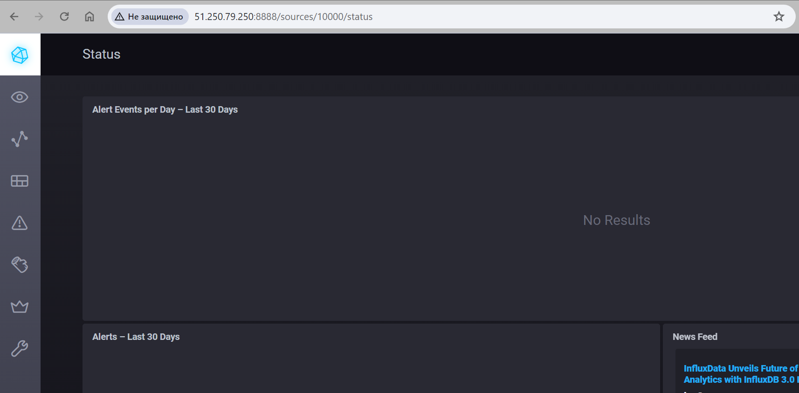
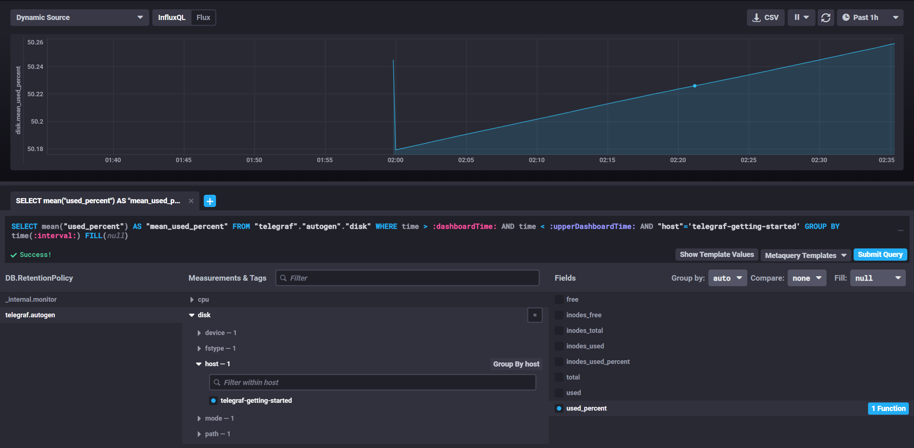
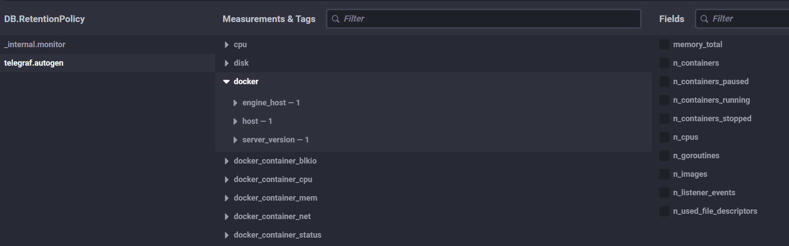

# Домашнее задание к занятию "13.Системы мониторинга"

## Обязательные задания

1. Вас пригласили настроить мониторинг на проект. На онбординге вам рассказали, что проект представляет из себя 
платформу для вычислений с выдачей текстовых отчетов, которые сохраняются на диск. Взаимодействие с платформой 
осуществляется по протоколу http. Также вам отметили, что вычисления загружают ЦПУ. Какой минимальный набор метрик вы
выведите в мониторинг и почему?
    ### Ответ
    Минимальный набор метрик для мониторинга платформы для вычислений с выдачей текстовых отчетов:
      - Загрузка CPU: чтобы отслеживать нагрузку на процессор, так как вычисления загружают ЦПУ.
      - Количество запросов к платформе по протоколу HTTP: для измерения активности платформы и оценки нагрузки.
      - Объем использованной оперативной памяти (RAM): чтобы контролировать потребление памяти.
      - Количество сохраненных отчетов на диске (inodes): для оценки объема данных и контроля доступного места.

#

2. Менеджер продукта посмотрев на ваши метрики сказал, что ему непонятно что такое RAM/inodes/CPUla. Также он сказал, 
что хочет понимать, насколько мы выполняем свои обязанности перед клиентами и какое качество обслуживания. Что вы 
можете ему предложить?
    ### Ответ
    Для менеджера продукта можно предложить следующие метрики, связанные с обязательствами перед клиентами:
      - Время отклика платформы на запросы клиентов.
      - Количество ошибок сервера (например, коды ответа 5xx) во время запросов клиентов.
      - Процент успешно выполненных запросов клиентов.

#

3. Вашей DevOps команде в этом году не выделили финансирование на построение системы сбора логов. Разработчики в свою 
очередь хотят видеть все ошибки, которые выдают их приложения. Какое решение вы можете предпринять в этой ситуации, 
чтобы разработчики получали ошибки приложения?
    ### Ответ
    Для сбора ошибок приложений без финансирования на построение системы сбора логов можно использовать сторонние сервисы для централизованного сбора и анализа логов, такие как ELK Stack, TICK Stack, Prometheus + Loki + Grafana, Graylog, Sentry и другие. 

#

4. Вы, как опытный SRE, сделали мониторинг, куда вывели отображения выполнения SLA=99% по http кодам ответов. 
Вычисляете этот параметр по следующей формуле: summ_2xx_requests/summ_all_requests. Данный параметр не поднимается выше 
70%, но при этом в вашей системе нет кодов ответа 5xx и 4xx. Где у вас ошибка?
    ### Ответ
    Если параметр SLA = 99% по http-кодам ответов не поднимается выше 70%, несмотря на отсутствие кодов ответа 5xx и 4xx, возможно, проблема кроется в других http-кодах, например, 3xx (редиректы) или долгих запросах (например, 408 - Request Timeout). 

#

5. Опишите основные плюсы и минусы pull и push систем мониторинга.  
    ### Ответ  
    Pull:  
      **+** Низкая нагрузка на целевые системы, так как мониторинговый сервер запрашивает данные.  
      **-** Возможна задержка в обнаружении проблем из-за интервалов опроса.  

    Push:  
      **+** Мгновенное обнаружение проблем благодаря активной отправке данных.  
      **-** Большая нагрузка на целевые системы из-за активной отправки данных.    

#

6. Какие из ниже перечисленных систем относятся к push модели, а какие к pull? А может есть гибридные?  
    ### Ответ
        - Prometheus - pull 
        - TICK - push
        - Zabbix - гибрид
        - VictoriaMetrics - push
        - Nagios - pull
#

7. Склонируйте себе [репозиторий](https://github.com/influxdata/sandbox/tree/master) и запустите TICK-стэк, 
используя технологии docker и docker-compose. В виде решения на это упражнение приведите скриншот веб-интерфейса ПО chronograf (`http://localhost:8888`). 
P.S.: если при запуске некоторые контейнеры будут падать с ошибкой - проставьте им режим `Z`, например
`./data:/var/lib:Z`  
    ### Ответ  
      

#

8. Перейдите в веб-интерфейс Chronograf (`http://localhost:8888`) и откройте вкладку `Data explorer`.

  - Нажмите на кнопку `Add a query`
  - Изучите вывод интерфейса и выберите БД `telegraf.autogen`
  - В `measurments` выберите mem->host->telegraf_container_id , а в `fields` выберите used_percent. Внизу появится график утилизации оперативной памяти в контейнере telegraf.
  - Вверху вы можете увидеть запрос, аналогичный SQL-синтаксису. 
    Поэкспериментируйте с запросом, попробуйте изменить группировку и интервал наблюдений. Для выполнения задания приведите скриншот с отображением метрик утилизации места на диске (disk->host->telegraf_container_id) из веб-интерфейса.  
    ### Ответ  
      

#

9. Изучите список [telegraf inputs](https://github.com/influxdata/telegraf/tree/mastermcmc/plugins/inputs). 
Добавьте в конфигурацию telegraf следующий плагин - [docker](https://github.com/influxdata/telegraf/tree/master/plugins/inputs/docker):
После настройке перезапустите telegraf, обновите веб интерфейс и приведите скриншотом список `measurments` в 
веб-интерфейсе базы telegraf.autogen . Там должны появиться метрики, связанные с docker.
    ### Ответ  
      

---

