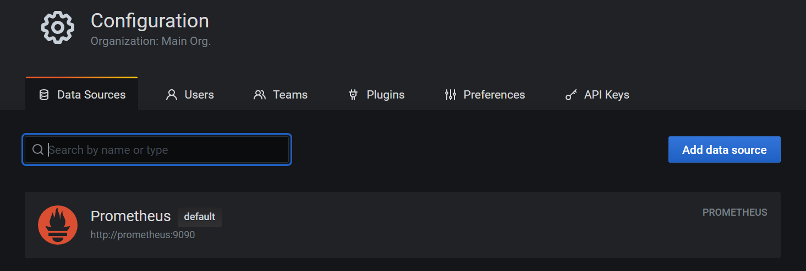
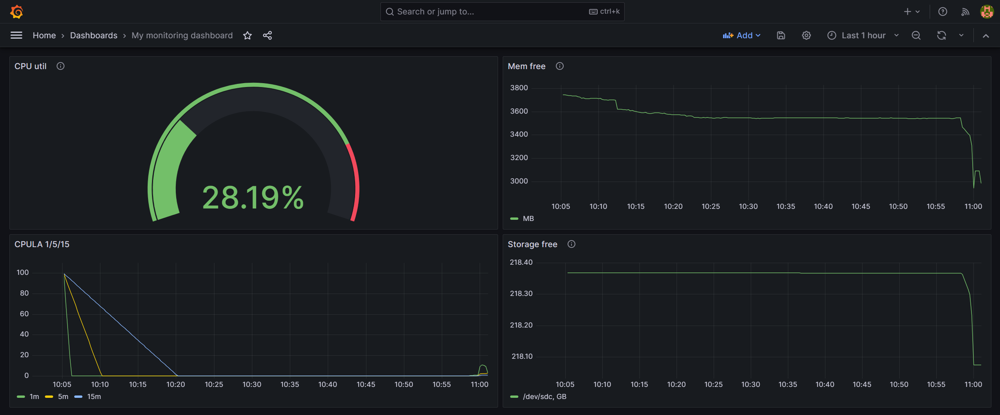
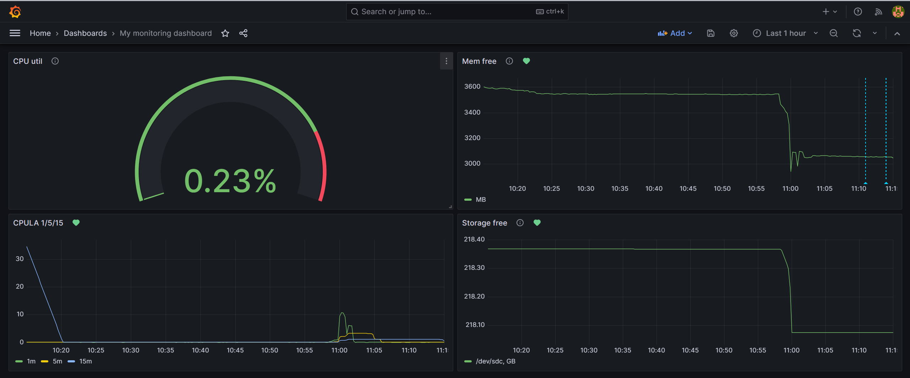
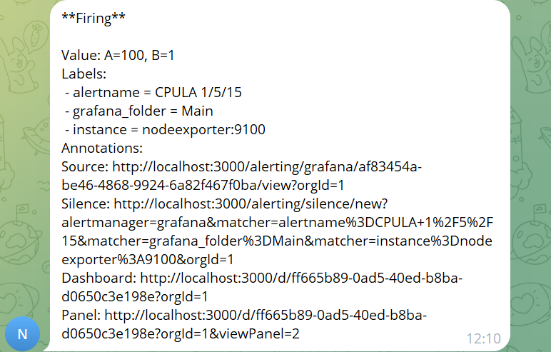

# Домашнее задание к занятию 14 «Средство визуализации Grafana»

## Обязательные задания

### Задание 1

1. Используя директорию [help](./help) внутри этого домашнего задания, запустите связку prometheus-grafana.
1. Зайдите в веб-интерфейс grafana, используя авторизационные данные, указанные в манифесте docker-compose.
1. Подключите поднятый вами prometheus, как источник данных.
1. Решение домашнего задания — скриншот веб-интерфейса grafana со списком подключенных Datasource.

### Ответ



## Задание 2

Изучите самостоятельно ресурсы:

1. [PromQL tutorial for beginners and humans](https://valyala.medium.com/promql-tutorial-for-beginners-9ab455142085).
1. [Understanding Machine CPU usage](https://www.robustperception.io/understanding-machine-cpu-usage).
1. [Introduction to PromQL, the Prometheus query language](https://grafana.com/blog/2020/02/04/introduction-to-promql-the-prometheus-query-language/).

Создайте Dashboard и в ней создайте Panels:

- утилизация CPU для nodeexporter (в процентах, 100-idle);
- CPULA 1/5/15;
- количество свободной оперативной памяти;
- количество места на файловой системе.

### Ответ



```
# утилизация CPU для nodeexporter (в процентах, 100-idle)
100 - avg by (instance) (irate(node_cpu_seconds_total{mode="idle"}[5m])) * 100

#CPULA 1/5/15
100 - avg by (instance) (rate(node_cpu_seconds_total{mode="idle"}[1m]) * 100)
100 - avg by (instance) (rate(node_cpu_seconds_total{mode="idle"}[5m]) * 100)
100 - avg by (instance) (rate(node_cpu_seconds_total{mode="idle"}[15m]) * 100)

#количество свободной оперативной памяти
node_memory_MemFree_bytes / 1024 / 1024

#количество места на файловой системе
node_filesystem_avail_bytes / 1024 / 1024 / 1024


```

## Задание 3

1. Создайте для каждой Dashboard подходящее правило alert — можно обратиться к первой лекции в блоке «Мониторинг».
1. В качестве решения задания приведите скриншот вашей итоговой Dashboard.

### Ответ

  




## Задание 4

1. Сохраните ваш Dashboard.Для этого перейдите в настройки Dashboard, выберите в боковом меню «JSON MODEL». Далее скопируйте отображаемое json-содержимое в отдельный файл и сохраните его.
1. В качестве решения задания приведите листинг этого файла.

### Ответ

```json
{
  "annotations": {
    "list": [
      {
        "builtIn": 1,
        "datasource": {
          "type": "grafana",
          "uid": "-- Grafana --"
        },
        "enable": true,
        "hide": true,
        "iconColor": "rgba(0, 211, 255, 1)",
        "name": "Annotations & Alerts",
        "type": "dashboard"
      }
    ]
  },
  "editable": true,
  "fiscalYearStartMonth": 0,
  "graphTooltip": 0,
  "id": 2,
  "links": [],
  "liveNow": false,
  "panels": [
    {
      "datasource": {
        "type": "prometheus",
        "uid": "_oMVwcdSk"
      },
      "description": "Утилизация CPU для nodeexporter (в процентах, 100-idle)",
      "fieldConfig": {
        "defaults": {
          "color": {
            "mode": "thresholds"
          },
          "decimals": 2,
          "mappings": [],
          "thresholds": {
            "mode": "absolute",
            "steps": [
              {
                "color": "green",
                "value": null
              },
              {
                "color": "red",
                "value": 80
              }
            ]
          },
          "unit": "percent"
        },
        "overrides": []
      },
      "gridPos": {
        "h": 8,
        "w": 12,
        "x": 0,
        "y": 0
      },
      "id": 1,
      "options": {
        "minVizHeight": 200,
        "minVizWidth": 200,
        "orientation": "auto",
        "reduceOptions": {
          "calcs": [
            "lastNotNull"
          ],
          "fields": "",
          "values": false
        },
        "showThresholdLabels": false,
        "showThresholdMarkers": true,
        "sizing": "auto",
        "text": {}
      },
      "pluginVersion": "10.2.3",
      "targets": [
        {
          "datasource": {
            "type": "prometheus",
            "uid": "_oMVwcdSk"
          },
          "disableTextWrap": false,
          "editorMode": "code",
          "expr": "100 - (avg by (instance) (irate(node_cpu_seconds_total{mode=\"idle\"}[5m])) * 100)",
          "fullMetaSearch": false,
          "includeNullMetadata": true,
          "instant": false,
          "legendFormat": "100 - idle %",
          "range": true,
          "refId": "A",
          "useBackend": false
        }
      ],
      "title": "CPU util",
      "type": "gauge"
    },
    {
      "datasource": {
        "type": "prometheus",
        "uid": "_oMVwcdSk"
      },
      "description": "Mb",
      "fieldConfig": {
        "defaults": {
          "color": {
            "mode": "palette-classic"
          },
          "custom": {
            "axisBorderShow": false,
            "axisCenteredZero": false,
            "axisColorMode": "text",
            "axisLabel": "",
            "axisPlacement": "auto",
            "barAlignment": 0,
            "drawStyle": "line",
            "fillOpacity": 0,
            "gradientMode": "none",
            "hideFrom": {
              "legend": false,
              "tooltip": false,
              "viz": false
            },
            "insertNulls": false,
            "lineInterpolation": "linear",
            "lineWidth": 1,
            "pointSize": 5,
            "scaleDistribution": {
              "type": "linear"
            },
            "showPoints": "auto",
            "spanNulls": false,
            "stacking": {
              "group": "A",
              "mode": "none"
            },
            "thresholdsStyle": {
              "mode": "off"
            }
          },
          "mappings": [],
          "thresholds": {
            "mode": "absolute",
            "steps": [
              {
                "color": "green",
                "value": null
              },
              {
                "color": "red",
                "value": 80
              }
            ]
          }
        },
        "overrides": []
      },
      "gridPos": {
        "h": 8,
        "w": 12,
        "x": 12,
        "y": 0
      },
      "id": 3,
      "options": {
        "legend": {
          "calcs": [],
          "displayMode": "list",
          "placement": "bottom",
          "showLegend": true
        },
        "tooltip": {
          "mode": "single",
          "sort": "none"
        }
      },
      "targets": [
        {
          "datasource": {
            "type": "prometheus",
            "uid": "_oMVwcdSk"
          },
          "editorMode": "code",
          "expr": "node_memory_MemFree_bytes / 1024 / 1024",
          "instant": false,
          "legendFormat": "MB",
          "range": true,
          "refId": "A"
        }
      ],
      "title": "Mem free",
      "type": "timeseries"
    },
    {
      "datasource": {
        "type": "prometheus",
        "uid": "_oMVwcdSk"
      },
      "fieldConfig": {
        "defaults": {
          "color": {
            "mode": "palette-classic"
          },
          "custom": {
            "axisBorderShow": false,
            "axisCenteredZero": false,
            "axisColorMode": "text",
            "axisLabel": "",
            "axisPlacement": "auto",
            "barAlignment": 0,
            "drawStyle": "line",
            "fillOpacity": 0,
            "gradientMode": "none",
            "hideFrom": {
              "legend": false,
              "tooltip": false,
              "viz": false
            },
            "insertNulls": false,
            "lineInterpolation": "linear",
            "lineWidth": 1,
            "pointSize": 5,
            "scaleDistribution": {
              "type": "linear"
            },
            "showPoints": "auto",
            "spanNulls": false,
            "stacking": {
              "group": "A",
              "mode": "none"
            },
            "thresholdsStyle": {
              "mode": "off"
            }
          },
          "mappings": [],
          "thresholds": {
            "mode": "absolute",
            "steps": [
              {
                "color": "green",
                "value": null
              },
              {
                "color": "red",
                "value": 80
              }
            ]
          }
        },
        "overrides": []
      },
      "gridPos": {
        "h": 8,
        "w": 12,
        "x": 0,
        "y": 8
      },
      "id": 2,
      "options": {
        "legend": {
          "calcs": [],
          "displayMode": "list",
          "placement": "bottom",
          "showLegend": true
        },
        "tooltip": {
          "mode": "single",
          "sort": "none"
        }
      },
      "targets": [
        {
          "datasource": {
            "type": "prometheus",
            "uid": "_oMVwcdSk"
          },
          "editorMode": "code",
          "expr": "100 - avg by (instance) (rate(node_cpu_seconds_total{mode=\"idle\"}[1m]) * 100)",
          "instant": false,
          "legendFormat": "1m",
          "range": true,
          "refId": "1m"
        },
        {
          "datasource": {
            "type": "prometheus",
            "uid": "_oMVwcdSk"
          },
          "editorMode": "code",
          "expr": "100 - avg by (instance) (rate(node_cpu_seconds_total{mode=\"idle\"}[5m])*100)",
          "hide": false,
          "instant": false,
          "legendFormat": "5m",
          "range": true,
          "refId": "5m"
        },
        {
          "datasource": {
            "type": "prometheus",
            "uid": "_oMVwcdSk"
          },
          "editorMode": "code",
          "expr": "100 - avg by (instance) (rate(node_cpu_seconds_total{mode=\"idle\"}[15m])*100)",
          "hide": false,
          "instant": false,
          "legendFormat": "15m",
          "range": true,
          "refId": "15m"
        }
      ],
      "title": "CPULA 1/5/15",
      "type": "timeseries"
    },
    {
      "datasource": {
        "type": "prometheus",
        "uid": "_oMVwcdSk"
      },
      "description": "Gb",
      "fieldConfig": {
        "defaults": {
          "color": {
            "mode": "palette-classic"
          },
          "custom": {
            "axisBorderShow": false,
            "axisCenteredZero": false,
            "axisColorMode": "text",
            "axisLabel": "",
            "axisPlacement": "auto",
            "barAlignment": 0,
            "drawStyle": "line",
            "fillOpacity": 0,
            "gradientMode": "none",
            "hideFrom": {
              "legend": false,
              "tooltip": false,
              "viz": false
            },
            "insertNulls": false,
            "lineInterpolation": "linear",
            "lineWidth": 1,
            "pointSize": 5,
            "scaleDistribution": {
              "type": "linear"
            },
            "showPoints": "auto",
            "spanNulls": false,
            "stacking": {
              "group": "A",
              "mode": "none"
            },
            "thresholdsStyle": {
              "mode": "off"
            }
          },
          "decimals": 2,
          "mappings": [],
          "thresholds": {
            "mode": "absolute",
            "steps": [
              {
                "color": "green",
                "value": null
              },
              {
                "color": "red",
                "value": 80
              }
            ]
          }
        },
        "overrides": []
      },
      "gridPos": {
        "h": 8,
        "w": 12,
        "x": 12,
        "y": 8
      },
      "id": 4,
      "options": {
        "legend": {
          "calcs": [],
          "displayMode": "list",
          "placement": "bottom",
          "showLegend": true
        },
        "tooltip": {
          "mode": "single",
          "sort": "none"
        }
      },
      "targets": [
        {
          "datasource": {
            "type": "prometheus",
            "uid": "_oMVwcdSk"
          },
          "editorMode": "code",
          "expr": "node_filesystem_avail_bytes / 1024 / 1024 / 1024",
          "instant": false,
          "legendFormat": "{{device}}, GB",
          "range": true,
          "refId": "A"
        }
      ],
      "title": "Storage free",
      "type": "timeseries"
    }
  ],
  "refresh": "",
  "schemaVersion": 39,
  "tags": [],
  "templating": {
    "list": []
  },
  "time": {
    "from": "now-1h",
    "to": "now"
  },
  "timepicker": {},
  "timezone": "",
  "title": "My monitoring dashboard",
  "uid": "ff665b89-0ad5-40ed-b8ba-d0650c3e198e",
  "version": 19,
  "weekStart": ""
}
```

---

